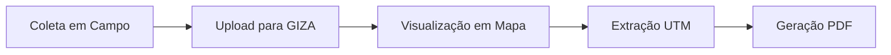

# Discovery - Prospecção Arqueológica (PAIPA)

## Informações da Entrevista

**Stakeholder**: Marcos Victor Gomes de Oliveira  
**E-mail**: marcos.gomes@grupozago.com.br  
**Data**: 02/09/2025, 15:58:28  
**Contexto**: Primeira experiência da Zago com prospecção arqueológica

---

## Recursos Disponíveis

**Link da ficha de coleta**: [Modelo no SharePoint](https://grupozago-my.sharepoint.com/:x:/g/personal/marcos_gomes_grupozago_com_br/ETXljj48QPNLjOxJc_s_GXoBG2y7Mm0eGW0te3g3OsSD8A?wdOrigin=TEAMS-MAGLEV.p2p_ns.rwc&wdExp=TEAMS-TREATMENT&wdhostclicktime=1756919386802&web=1)

---

## Processo Atual e Proposta

### Situação Atual

- **Método**: Processo manual com fichas de campo em papel
- **Sistematização**: Transcrição posterior para planilhas Excel no escritório
- **Status**: Primeira implementação (sem processo anterior estabelecido)

### Objetivo da Digitalização

Otimizar tanto o tempo em campo quanto o trabalho de sistematização no escritório através da automatização completa do processo.

---

## Problemas Identificados

| **Problema**                 | **Descrição**                                              | **Impacto** |
| ---------------------------- | ---------------------------------------------------------- | ----------- |
| **Perda de Informações**     | Risco de perder dados importantes coletados em campo       | Alto        |
| **Falta de Padronização**    | Ausência de um processo de coleta uniforme                 | Médio       |
| **Ineficiência Operacional** | Perda de tempo com processos manuais em campo e escritório | Alto        |

---

## Requisitos de Dados

### Informações Básicas

- **Responsável técnico**
- **Data da coleta**
- **Local**
- **Coordenadas geográficas**

### Características da Área

- **Relevo**
- **Vegetação**
- **Compartimentação**
- **Superfície**
- **Antropização**
- **Agente/Atividade**

### Descrição do Poço-Teste

- **Profundidade**
- **Textura**
- **Compactação**
- **Coloração**
- **Fator Intransponível**

### Documentação

- **Fotos** do local e achados
- **Ocorrências** (Sim/Não) com descrição detalhada

---

## Fluxo de Trabalho Idealizado

### Etapas do Processo

1. **Coleta em campo** - Preenchimento do formulário digital
2. **Upload automático** - Sincronização dos dados para a plataforma GIZA
3. **Visualização em mapa** - Pontos de coleta georreferenciados
4. **Extração de coordenadas UTM** - Para relatórios técnicos
5. **Geração de PDF** - Ficha de campo para anexar ao relatório final

---

## Funcionalidades Priorizadas

### 🎯 Essenciais (MVP)

- Coleta de dados em campo via formulário digital
- Upload/sincronização automática com GIZA
- Mapa interativo com pontos coletados
- Geração automática de ficha de campo em PDF

### 📋 Complementares

- Exportação de pontos em formato KML/KMZ
- Lista simples de registros
- Relatório PDF automático avançado

---

## Visualização e Acompanhamento

### Interface Desejada

- **Lista simples** dos registros coletados
- **Mapa com geolocalização** dos pontos
- **Relatório PDF automático** para documentação
---

## Requisitos Técnicos

### Funcionalidade Offline

- **Obrigatório**: O sistema deve funcionar offline
- **Justificativa**: Trabalho em campo frequentemente sem conectividade

### Plataformas Suportadas

- **Mobile**: Android e iOS
- **Desktop**: Navegador web (PC)
- **Acesso**: Ambas as plataformas devem ter funcionalidade completa

### Integrações

- **GIZA**: Sistema central para armazenamento de dados
- **Coordenadas UTM**: Extração para relatórios técnicos
- **Exportação**: Múltiplos formatos (PDF, KML/KMZ)

---

## Diferenciais Identificados

### Oportunidades

- **Primeira implementação**: Sem vícios de processos anteriores
- **Automatização completa**: Eliminação total do processo manual
- **Padronização desde o início**: Processo uniforme estabelecido
- **Integração direta**: Conexão com sistema GIZA existente

### Simplicidade

- **Sem rastreabilidade complexa**: Foco na eficiência da coleta
- **Interface intuitiva**: Para uso em campo por diferentes perfis
- **Fluxo linear**: Processo direto sem ramificações complexas

---

## Próximos Passos

1. **Análise detalhada** do modelo de ficha existente
2. **Definição da estrutura** de dados no GIZA
3. **Especificação técnica** das integrações
4. **Prototipagem** da interface mobile
5. **Validação** com teste piloto em campo

---

## Navegação

- [← Voltar ao Módulo 230](../../../index.md)
- [Próximo: Elicitação →](../elicitacao/arqueologia.md)
