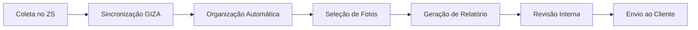

# Discovery - Módulo Eletronorte

## 1. Processos Atuais e Necessidades de Digitalização

### 📋 Relatório Mensal de Atividades

**Processo Atual:**

- Registros fotográficos realizados com **3 aparelhos celulares** ao longo do mês
- Atividades registradas no **viveiro** e na **Estação Ecológica (ESEC)**
- No final do mês: download manual, organização em pastas por atividade/data
- Upload manual para **Google Drive** do projeto
- Elaboração manual do relatório baseado em registros e anotações internas
- Revisão e envio ao cliente

**💡 Análise Técnica:**

- ✅ **Solução proposta**: Coleta direta no **ZS** com sincronização automática para **GIZA**
- ✅ **Visualização**: Filtros por atividade e data para facilitar extração
- ✅ **Funcionalidade**: Sistema de **favoritar fotos** (similar ao Engeform) para seleção em lote

### 🌱 Contagem e Medição de Mudas no Viveiro

**Processo Atual:**

- Contagem e medição **manual** das mudas
- Inserção de dados no app **Mata Nativa**
- Download dos dados para **planilhas Excel**
- Cálculos realizados via **tabelas dinâmicas**
- Gestão do viveiro baseada nesses controles

**Principais Dores:**

- Grande volume de dados coletados em diferentes aparelhos
- Download, organização e upload manuais
- Transferência manual dos dados do Mata Nativa para Excel
- Montagem manual de relatórios sujeita a erros
- Falta de integração entre processos

**💡 Análise Técnica:**

- ✅ **Solução proposta**: Sistema de contagem integrado ao **ZS**
- ✅ **Funcionalidade**: Exportação direta para Excel
- 🔍 **Investigação necessária**:
  - Entender fluxo completo do Mata Nativa
  - Viabilidade de realizar todos os cálculos no GIZA
  - Tipos de cálculos realizados
  - Tempo gasto na etapa de tratamento de dados

  No mata nativa: insere nome da especie e altura, realizar media de alturas

---

## 2. Problemas e Dores Identificadas

### 🚨 Principais Gargalos do Processo Atual

| **Área**            | **Problema**                        | **Impacto**                             |
| ------------------- | ----------------------------------- | --------------------------------------- |
| **Coleta de Dados** | Múltiplos aparelhos desconectados   | Retrabalho e desorganização             |
| **Organização**     | Download/upload manual de arquivos  | Perda de tempo e risco de erros         |
| **Integração**      | Transferência manual entre sistemas | Falta de rastreabilidade                |
| **Relatórios**      | Montagem completamente manual       | Alto risco de falhas e inconsistências  |
| **Gestão**          | Ausência de sistema unificado       | Dificuldade no acompanhamento integrado |

**💡 Oportunidades de Melhoria:**

- ✅ Automatização na geração de relatórios formatados
- ✅ Inserção automática de fotos favoritadas nos campos necessários
- 🔍 **Avaliar**: Necessidade de relatórios editáveis

---

## 3. Campos e Informações Necessárias

### 📊 Estrutura de Dados Proposta

#### **Módulo: Atividades Mensais**

| **Campo**           | **Tipo**        | **Obrigatório** | **Observações**                |
| ------------------- | --------------- | --------------- | ------------------------------ |
| Local de atividade   | Lista suspensa  | ✅              | Viveiro, ESEC, Plantio, etc.   |
| Tipo de atividade  | Lista suspensa  | ✅              | Plantio, etc.   |
| Georeferenciamento | Texto/GPS       | ✅              | Georreferenciamento automático |
| Data da atividade   | Data            | ✅              | Captura automática             |
| Descrição resumida  | Texto longo     | ✅              | Campo de observações           |
| Responsável técnico | Lista suspensa  | ✅              | Usuários cadastrados           |
| Quantitativos       | Numérico        | ❌              | Nº mudas, participantes, etc.  |
| Fotos               | Upload múltiplo | ✅              | Com sistema de favoritos       |
| Observações         | Texto longo     | ❌              | Informações complementares     |

#### **Módulo: Contagem de Mudas**

| **Campo**                | **Tipo**       | **Obrigatório** | **Observações**            |
| ------------------------ | -------------- | --------------- | -------------------------- |
| Data da contagem         | Data           | ✅              | Captura automática         |
| Setor    | Selecionar    | ✅              | Casa de sombra, Pleno sol   |
| Nome da muda        | Selecionar     | ✅              | 14 especies e outro         |
| Altura     | Númerico    | ✅              | numérico      |

---

## 4. Fluxo Operacional Idealizado

### 🔄 Processo Otimizado

**Etapas Detalhadas:**

1. **📱 Coleta Centralizada**: Acesso às informações via sistema unificado
2. **☁️ Upload Automático**: Fotos e documentos direto no Drive do projeto
3. **🤖 Geração Automática**: Relatório baseado nos dados inseridos
4. **👥 Revisão Interna**: Validação da equipe técnica
5. **📤 Envio Final**: Entrega ao cliente com rastreabilidade

---

## 5. Priorização de Funcionalidades (MVP)

### 🎯 Fase 1 - Essencial

1. **Cadastro e registro** de atividades mensais e de campo
2. **Upload e organização automática** de fotos por atividade/data
3. **Geração automática** de relatórios em modelo padronizado

### 🌟 Fase 2 - Desejável

- **Geração de gráficos** com indicadores das atividades
  - Taxa de mortalidade
  - Número de sementes plantadas
  - Número de mudas por espécie
  - Áreas de pleno sol, etc.

---

## 6. Visualização e Acompanhamento

### 📈 Interfaces Propostas

| **Tipo de Visualização** | **Funcionalidade**        | **Usuário Alvo**    |
| ------------------------ | ------------------------- | ------------------- |
| **Tabela Filtrável**     | Busca e filtros avançados | Técnicos e gestores |
| **Calendário de Prazos** | Acompanhamento temporal   | Gestores            |
| **Cards por Status**     | Visão rápida do progresso | Todos os usuários   |

---

## 7. Referências e Modelos

### 📋 Documentação Base

- **Modelo de Relatório**: [Relatório Eletronorte](https://grupozago.sharepoint.com/:w:/s/Eletronorte-PRFLT230kVR.Gon-Balsas/EfOeyDT3kClMvdHmiusB8GkBFQHY0UproNIdF2nWtRw6Ww?e=pFwfHJ)
- **Sistema de Referência**: **Mata Nativa** (interface para inserção de dados)

### 🔍 Próximos Passos de Investigação

1. **Análise detalhada** do fluxo do Mata Nativa
2. **Mapeamento completo** dos cálculos realizados
3. **Quantificação** do tempo gasto em tratamento de dados
4. **Definição** dos tipos de dados complementares para fotos
5. **Validação** da viabilidade de migração completa para GIZA

especies para por no questionario de mudas: 
Nome comum 	Nome ciêntifico
Amburana	Amburana cearensis
Angico vermelho	Anadenanthera macrocarpa
Aroeira	Astronium urundeuva
Cagaita	Eugenia dysenterica
Candeia	Plathymenia foliolosa. 
Chicha	Sterculia striata
Copaiba	Copaifera langsdorffii
Embauba	Cecropia pachystachya
Ipe amarelo felpudo	Zeyheria tuberculosa
Ipe branco	Tabebuia roseo-alba
Ipe rosa	Handroanthus heptaphyllus
Ipe roxo	Handroanthus impetiginosus
Jacaranda	Jacaranda micrantha
Jurema branca	Mimosa verrucosa
Mutamba	Guazuma ulmifolia
Pacari	Lafoensia pacari
Parkia	Parkia platycephala

